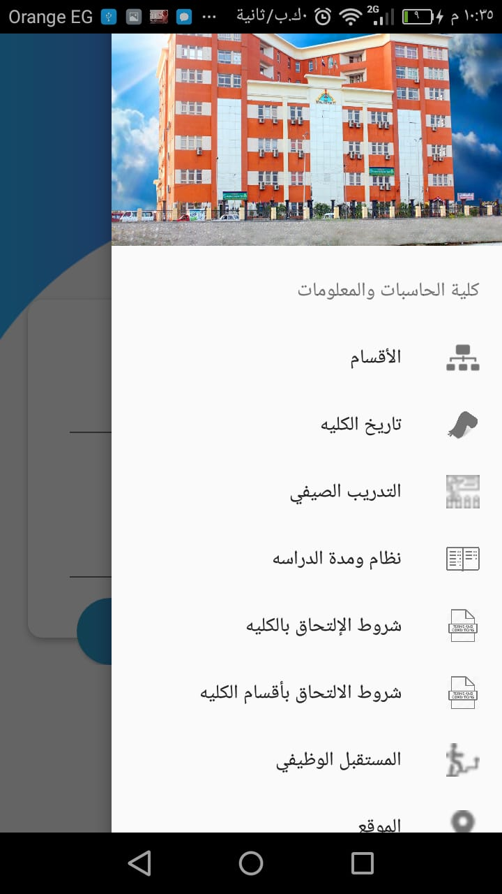
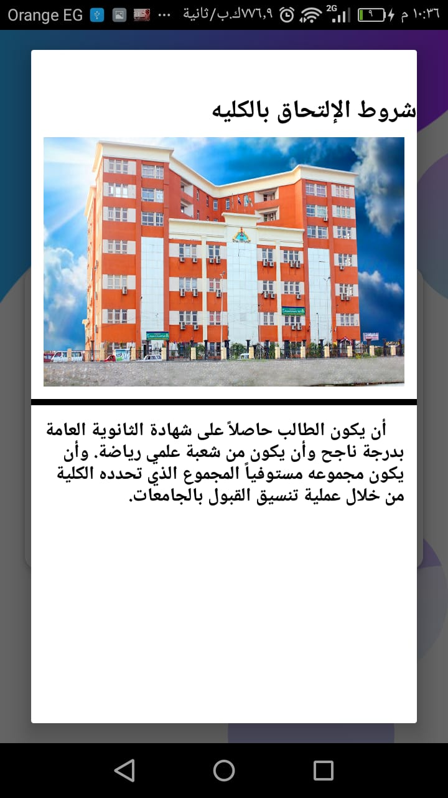
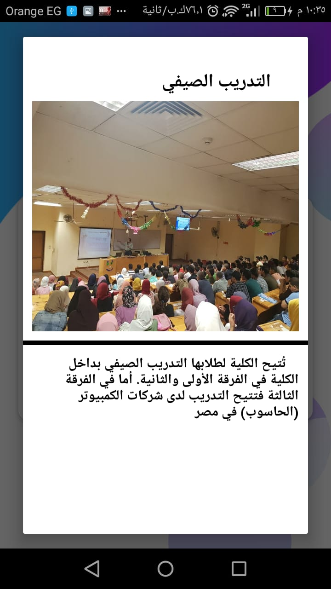
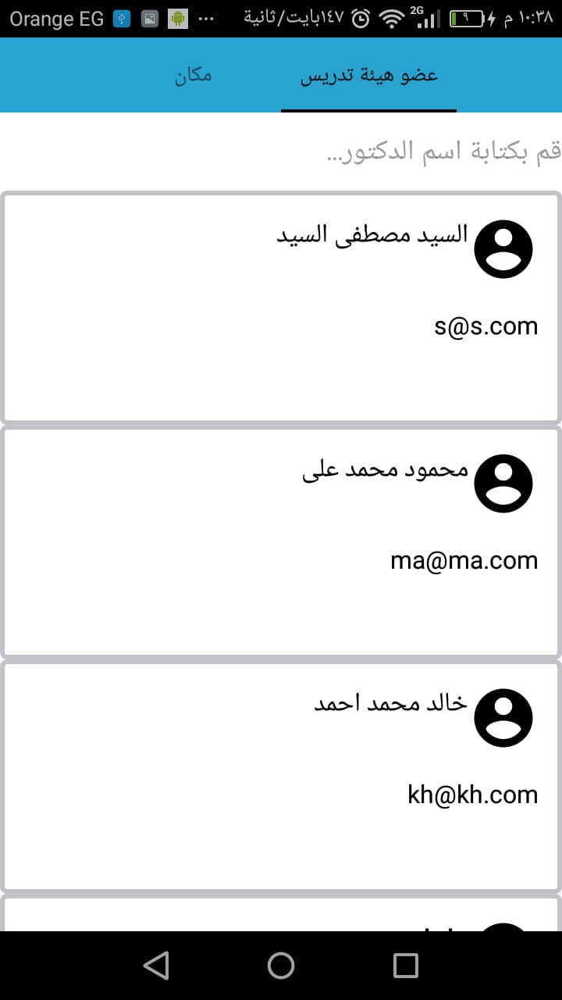
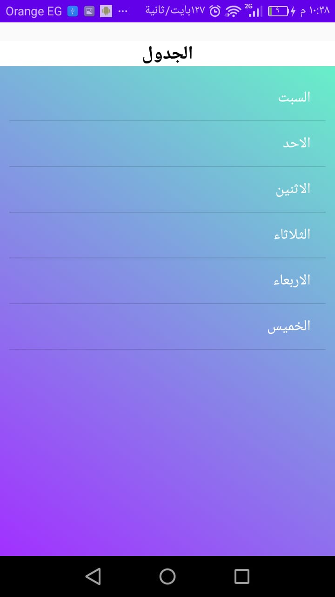
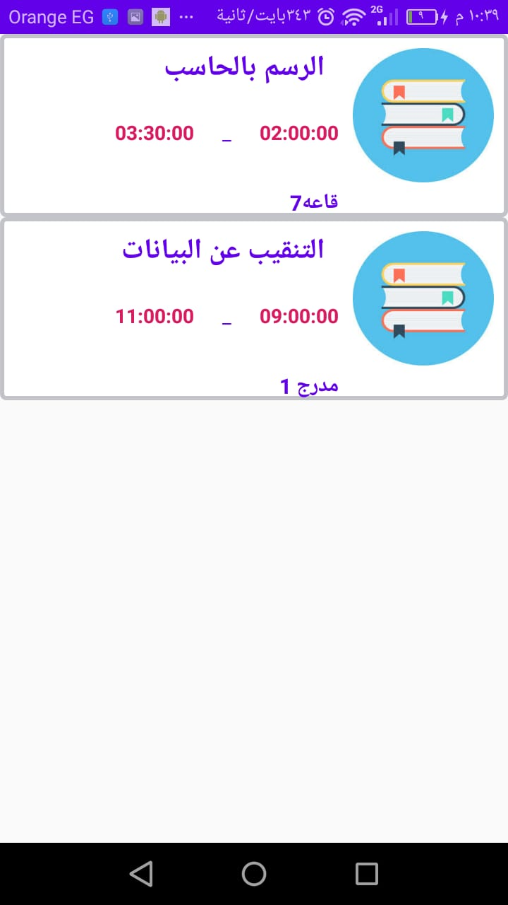
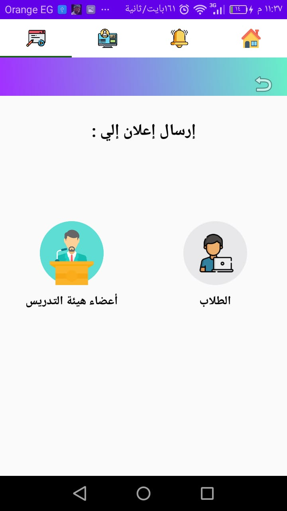

# GraduationProject
Arabic Mobile Aplication for my Faculty BFCI which mange Student and Teaching Staff Stuff like Courses ,Schaduale , Annoncements And Ather Services 
all these Data Are Stored in Database file which Called grsduation.sql you have to import it to your server
these Data are manipulate with PHP webservices that are in Android folder you have to put it into youre hddocs folder in your xamp server
for a better  design you have to change your phone language into Arabic

